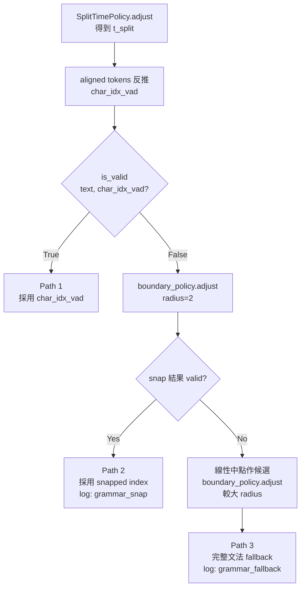

# ADR-0004: VAD-driven 切分 × 文法 Sanity Check 整合方針

## Status

Proposed

## Context

Cue 切分目前由兩條 policy 軸線共同決定（見 [[pipeline-post-processing-processors]]）：

- **時間軸**：[[../openspec/specs/split-time-policy/spec|SplitTimePolicy]] 決定切點落在 cue 內的哪個毫秒。
  - `LinearSplitTimePolicy`：直接回傳線性中點。
  - `VadAlignedSplitTimePolicy`：以 VAD silence 中點為主要訊號，在 cue 內找最近的靜音。
- **文字軸**：[[../openspec/specs/split-boundary-policy/spec|SplitBoundaryPolicy]] 決定切點落在文字字元的哪個 index。
  - `LinearSplitBoundaryPolicy`：直接回傳候選 index。
  - `JapaneseSplitBoundaryPolicy`：以助詞、活用尾、片假名、複合單位等規則做文法 sanity check（`_is_valid`），若候選 index 落在禁切點上，會在 search radius 內找最近的合法位置。

`japanese-aware-cue-split` 引入了文法 sanity check；隨後的 `vad-driven-cue-split` 則改成「先由 VAD silence 決定切分時間 → 透過 aligned tokens 把該時間反推回 `char_idx`」。VAD-driven 路徑是目前 character-boundary processor 的主要切分訊號。

### 觀察到的問題（2026-05-08，`test-samples/sample1` 人工驗證）

VAD-driven 路徑在「時間 → char_idx」的反推過程中，**完全跳過 `JapaneseSplitBoundaryPolicy` 的把關**。當 VAD silence 落在助動詞或動詞活用尾內部時，aligned tokens 會老實地把毫秒值對到 morpheme 中央，產生兩處 morpheme-internal 切點：

- cue 7/8：「専攻しておりまし／た」（`まし／た` 切開）
- cue 9/10：「覚えていま／す」（`い ま／す` 切開）

VAD silence 的物理訊號雖然合理（人聲確實有微小停頓），但不應凌駕於文法限制之上。同時，先前藉由 `JapaneseSplitBoundaryPolicy._is_valid` 處理的 leading-final / leading-particle 場景，在 VAD-driven 路徑下會悄悄退化。

### 必須面對的設計問題

1. VAD silence 與文法限制衝突時，誰是 source of truth？
2. 文法 sanity check 該嵌在 pipeline 的哪一層（policy 內、processor 內、或新增中介層）？
3. 若兩者都堅持，如何避免 VAD-driven 退回成「形同 LinearSplitTimePolicy」的黑箱降級？

## Decision

採用 **VAD 為主訊號、文法為 sanity gate** 的兩階段模型。在 character-boundary processor 完成「VAD silence → char_idx」反推後，**將該 char_idx 通過 `SplitBoundaryPolicy._is_valid` 檢查**，若 invalid 則在受限 radius 內 snap 至最近 valid 位置；若整個 radius 都 invalid，則退回完整文法 fallback（即等同於 `LinearSplitTimePolicy` + `JapaneseSplitBoundaryPolicy` 的舊路徑）。

具體決策：

1. **`SplitBoundaryPolicy` 介面新增 `is_valid(text, index) -> bool`**，作為 `adjust` 內部已存在的判定邏輯的對外暴露點。`LinearSplitBoundaryPolicy.is_valid` 一律回傳 `True`（保留向後相容）；`JapaneseSplitBoundaryPolicy.is_valid` 即現行 `_is_valid` 的公開版本，判定 mid-katakana / mid-digit / mid-no-split-unit / leading-particle / leading-final 五條規則。

2. **Character-boundary processor 內部 pipeline 變更**為：
   1. 呼叫 `SplitTimePolicy.adjust` 取得切分毫秒 `t_split`。
   2. 透過 aligned tokens 反推得到候選 `char_idx_vad`。
   3. **若 `boundary_policy.is_valid(text, char_idx_vad)` 為 `True`：採用 `char_idx_vad`**（VAD-driven 路徑成功）。
   4. **若 `False`：呼叫 `boundary_policy.adjust(text, char_idx_vad, vad_grammar_search_radius)` 在小範圍內 snap**。`vad_grammar_search_radius` 預設小（建議 2 字元），避免 snap 飄移過遠。
   5. **若 `adjust` 仍回傳 invalid（`adjust` 規範允許在無 valid 候選時回傳原 index）：退回完整文法 fallback** — 改用線性中點作為候選，對 `boundary_policy.adjust` 套用較大的 search radius（沿用現行 character-boundary processor 的 fallback radius）。

3. **VAD silence 仍是主要決策訊號**：步驟 3 是 happy path，多數 cue 應由此產出，不必走文法 fallback。文法只在 VAD silence 與文法明顯衝突時介入。

4. **Logging**：步驟 4、5 的觸發須寫 INFO log，欄位至少含 `cue_id`、`char_idx_vad`、`char_idx_final`、`fallback_reason`（`grammar_snap` / `grammar_fallback`），以便日後評估 VAD silence 與文法的衝突頻率。

5. **設定欄位**：新增 `PostProcessingConfig.vad_grammar_search_radius: int = 2`，集中於既有 `PostProcessingConfig`（見 [[pipeline-data-models]]），不另開設定區塊。

## Rationale

**為何 VAD 為主、文法為 sanity gate，而非反過來？**

VAD silence 反映實際聲學停頓，對切分時間的「自然感」貢獻最大（沒有人會在沒有停頓處被切開字幕）。文法規則只是禁止特定字串接縫，並不主動建議「哪裡是好切點」。讓文法當 gate 而非主導，可以保留 VAD-driven 帶來的時間貼合品質，僅在出錯時介入。

**為何不把 sanity check 推進 `SplitTimePolicy`？**

`SplitTimePolicy` 介面只看時間（毫秒），文法規則只看文字（index）。把文法 push 進時間軸會破壞 ISP（介面被迫多看一層），也讓 `VadAlignedSplitTimePolicy` 必須知道日文文法。維持兩個 policy 各自單一職責，由 character-boundary processor 串接，是最小耦合的方案。

**為何將 `is_valid` 提升為對外介面，而非在 processor 內 import 私有 `_is_valid`？**

讓 processor 直接戳 `_is_valid` 會使 processor 與 `JapaneseSplitBoundaryPolicy` 緊耦合，違反 DIP。提升為 protocol 介面讓 processor 只依賴抽象，未來新語言要加入 sanity check 時不需修改 processor。

**為何 `vad_grammar_search_radius` 預設只有 2，而完整 fallback 用較大 radius？**

VAD silence 訊號是強物理證據；若文法只是「再走 1–2 個字元就能找到合法點」，這通常是 morpheme 邊界對齊的小誤差，可信度高。一旦 radius 內找不到合法點，代表 VAD silence 落在語意上完全不該切的地方（例如片假名外來語中央），此時 VAD 訊號本身就是錯的，不該硬撐 — 退回線性中點 + 完整文法 fallback 才是正確選擇。

**為何完整 fallback 不是「保留 char_idx_vad、強制切下去」？**

那會回到 archive 前的舊行為（VAD-driven 跳過文法），ADR 的全部前提就會失效。寧可在罕見衝突時退回較不貼合 VAD 的線性切點，也不該保留已知 morpheme-internal 切點。

## Consequences

**正面**

- VAD-driven 路徑正確收斂為「VAD 主導 + 文法把關」，消除 morpheme-internal 切點。
- `SplitBoundaryPolicy` 介面職責清晰（`is_valid` + `adjust`），未來新增複合詞 / 漢字詞典保護（見 `docs/TODOs.md`）只需擴充 `JapaneseSplitBoundaryPolicy.is_valid`，VAD-driven 路徑與其他 processor 自動受惠。
- Logging 提供 VAD ↔ 文法衝突的可觀測性，可作為未來調整 `vad_grammar_search_radius` 與規則清單的依據。

**需注意的取捨**

- character-boundary processor 內部多了一層條件分支，單元測試需覆蓋三條路徑：VAD valid / VAD snap / 完整 fallback。
- `is_valid` 從私有 `_is_valid` 提升為公開介面，後續若要修改判定條件需注意對下游 processor 的相容性（屬於有意識的封閉點）。
- `vad_grammar_search_radius` 是新調參項；初期建議保持預設值 `2` 並透過 logging 累積數據再調整，避免過早優化。
- `LinearSplitBoundaryPolicy.is_valid` 永遠回 `True` 看似冗餘，但保留它讓非日文 pipeline 能用相同程式路徑（不需要 `if boundary_policy is None` 分支），符合 LSP。

## SOLID / 12-Factor Alignment

| 原則 | 如何滿足 |
|------|---------|
| SRP | `SplitTimePolicy` 只看時間；`SplitBoundaryPolicy` 只看文字；character-boundary processor 負責串接與 fallback 決策 |
| OCP | 新增語言文法規則只需新增 `SplitBoundaryPolicy` 實作；新增時間訊號來源只需新增 `SplitTimePolicy` 實作 |
| LSP | `LinearSplitBoundaryPolicy.is_valid` 永遠 `True`，可在所有 processor 中透明替換 `JapaneseSplitBoundaryPolicy` |
| ISP | `is_valid` 與 `adjust` 分離，呼叫方可只用其中一個；`SplitBoundaryPolicy` 不需感知時間軸資訊 |
| DIP | Processor 依賴 `SplitBoundaryPolicy` / `SplitTimePolicy` 介面，不直接 import 具體實作或私有方法 |
| Factor III (Config) | `vad_grammar_search_radius` 由 `PostProcessingConfig` 統一管理 |
| Factor XI (Logs) | 文法 snap / fallback 觸發事件寫入結構化日誌，便於後續評估 |

---

## Future Work

- **複合詞 / 漢字詞典保護**：擴充 `JapaneseSplitBoundaryPolicy.is_valid` 以涵蓋「自動的」、「解決策」、「稼働した」等案例（見 `docs/TODOs.md`）。本 ADR 的設計確保該擴充自動套用至 VAD-driven 路徑。
- **多語言 sanity gate**：未來其他語言若需要文法層級的禁切規則（例如韓文助詞），可新增對應 `SplitBoundaryPolicy` 實作，遵循本 ADR 的 valid → snap → fallback 三段式契約。
- **衡量指標**：透過 logging 累積實際 VAD ↔ 文法衝突率，回饋 `vad_grammar_search_radius` 預設值與規則清單擴充優先序。

---

## Walkthrough：三條路徑的實際運作

以下以一段假想的 cue 為基礎，示範 character-boundary processor 在不同情境下的行為。共用設定：

- 文字：`専攻しておりました`（長度 9）
- cue 時間：`cue_start_ms = 0`、`cue_end_ms = 9000`
- aligned tokens（character-level）：每個字元約佔 1000 ms（簡化示意）
  - `専 0–1000`、`攻 1000–2000`、`し 2000–3000`、`て 3000–4000`、`お 4000–5000`、`り 5000–6000`、`ま 6000–7000`、`し 7000–8000`、`た 8000–9000`
- `vad_grammar_search_radius = 2`
- `JapaneseSplitBoundaryPolicy` 預設規則：`た` 為 leading-final（前接 hiragana / kanji 時禁切）、`まし` 為 no-split-unit。

### Path 1：VAD 訊號與文法相容（happy path）

VAD silence 落在 `て`/`お` 之間（≈ 4000 ms），aligned tokens 反推得 `char_idx_vad = 4`：

| 步驟 | 數值 |
|------|------|
| `t_split` | 4000 |
| `char_idx_vad` | 4（切點 = `しておりました` → `してお` / `りました`） |
| `is_valid("専攻しておりました", 4)` | `True`（`text[3]='て'` hiragana、`text[4]='お'` hiragana，未觸發任何禁切規則） |
| 最終 `char_idx` | **4** |
| log | 無 |

VAD-driven 路徑直接成功，文法不介入。多數 cue 應走這條路。

### Path 2：VAD 訊號落在禁切點，小範圍 snap 即可救回

VAD silence 落在 `まし`/`た` 之間（≈ 8000 ms），對應「専攻しておりまし／た」這個實際觀察到的問題：

| 步驟 | 數值 |
|------|------|
| `t_split` | 8000 |
| `char_idx_vad` | 8（切點 = `専攻しておりまし` / `た`） |
| `is_valid(..., 8)` | `False` — 觸發 leading-final：`text[8:]` 以 `た` 開頭，`text[7]='し'` 是 hiragana |
| `boundary_policy.adjust(text, 8, radius=2)` | 在 `[6, 9]` 內找最近 valid：`6`（`まし` 之前）valid、`7`（會把 `まし` 切開）invalid mid-no-split-unit、`9 = len(text)` 不可、`8` invalid |
| 最終 `char_idx` | **6**（切點 = `専攻してお り` / `ました`）|
| log | `grammar_snap`，欄位含 `cue_id`、`char_idx_vad=8`、`char_idx_final=6`、`fallback_reason=grammar_snap` |

VAD silence 的時間訊號被尊重（仍貼近後段語句），但文字切點被拉到合法位置，避免拆開 `まし` / 把 `た` 變句首。

### Path 3：小範圍內全部 invalid，退回完整文法 fallback

假想極端情境：cue 為 `カタカナテストです`（外來語連續），VAD silence 落在中央（≈ 4500 ms），`char_idx_vad = 4`：

| 步驟 | 數值 |
|------|------|
| `t_split` | 4500 |
| `char_idx_vad` | 4（落在 `カタカナテスト` 內部） |
| `is_valid(..., 4)` | `False` — 觸發 mid-katakana |
| `boundary_policy.adjust(text, 4, radius=2)` | `[2, 6]` 全在片假名串內部，無 valid 候選；按 spec 規則 `adjust` 在無 valid 時回傳原 `candidate_index = 4`，仍 invalid |
| 退回完整 fallback：用線性中點 `len(text)//2 = 4` 作候選，套用 character-boundary processor 既有的較大 fallback radius | 找到 valid index `7`（`テスト` 之後、`です` 之前） |
| 最終 `char_idx` | **7**（切點 = `カタカナテスト` / `です`） |
| log | `grammar_fallback`，欄位含 `cue_id`、`char_idx_vad=4`、`char_idx_final=7`、`fallback_reason=grammar_fallback` |

VAD 訊號在這種情境下本來就不可靠（片假名外來語通常無內部停頓），讓位給文法是正確選擇。代價是切分時間不再貼近 VAD silence，但避免了「語意上完全切錯」的硬切。

### 三條路徑的觸發頻率預期

| 路徑 | 預期佔比 | 偵測方式 |
|------|---------|---------|
| Path 1（VAD valid） | 應該佔絕大多數 | 無 log |
| Path 2（grammar snap） | 少數，集中在助動詞 / 活用尾 | `grammar_snap` log |
| Path 3（grammar fallback） | 罕見，集中在外來語 / 數字串 | `grammar_fallback` log |

若實際運行後發現 Path 2 / Path 3 比例異常高，代表 VAD silence 訊號或文法規則需要調整 — 這正是日誌欄位設計的目的。

---

## 相關文件

- [[pipeline-post-processing-processors|後處理 Processor 與 Policy 設計]]
- [[pipeline-module-interfaces|模組介面設計]]
- [[ADR-0003-對齊粒度與後處理策略]]
- 相關 spec：[[../openspec/specs/split-boundary-policy/spec|split-boundary-policy]]、[[../openspec/specs/split-time-policy/spec|split-time-policy]]
