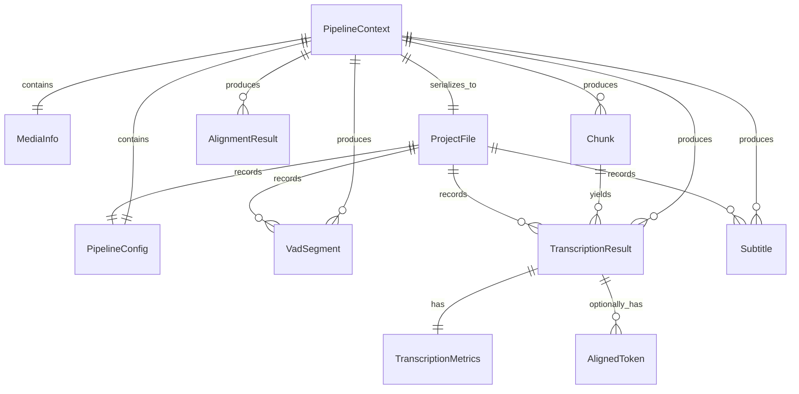
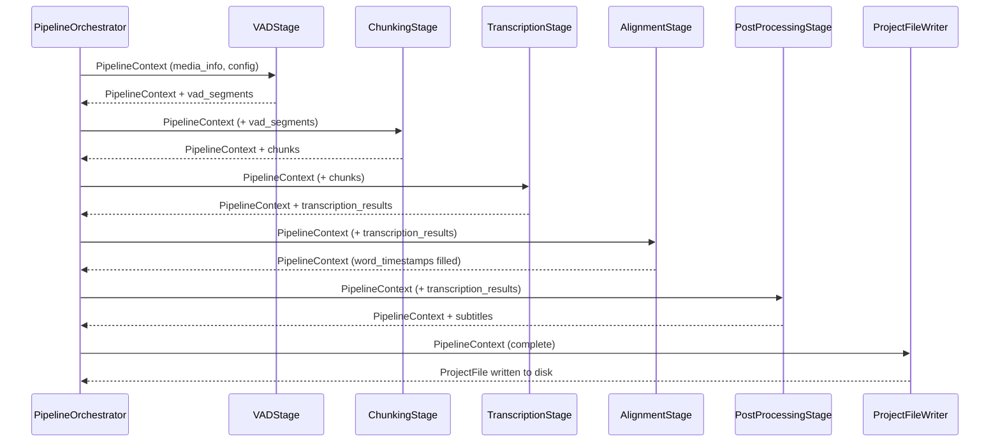

# Pipeline 資料模型

本文定義 Pipeline 各階段之間流動的主要資料結構。所有型別使用語言無關的偽型別描述；實作時對應至 Python `dataclass` 或 `TypedDict`。

---

## 1. 整體 ER 關係圖



---

## 2. 核心資料結構

### 2.1 PipelineContext

Pipeline 執行期間的共享狀態容器。每個 Stage 接收並回傳此物件（不可變風格：各 Stage 回傳新的實例或更新特定欄位）。

```
PipelineContext
├── config: PipelineConfig          # 從 YAML 載入的設定
├── media_info: MediaInfo           # 影音檔中繼資料
├── vad_segments: List[VadSegment]  # VAD Stage 輸出，初始為空
├── chunks: List[Chunk]             # Chunking Stage 輸出，初始為空
├── transcription_results: List[TranscriptionResult]  # Transcription Stage 輸出
├── alignment_status: AlignmentStatus                  # DISABLED / SUCCESS / FAILED（明確區分三態）
├── alignment_granularity: AlignmentGranularity | None # 僅 alignment_status == SUCCESS 時非 None
├── alignment_results: List[AlignmentResult]           # alignment_status != SUCCESS 時為空清單
└── subtitles: List[Subtitle]       # PostProcessing Stage 輸出（最終字幕）
```

### 2.2 MediaInfo

```
MediaInfo
├── file_path: str       # 影音檔的絕對路徑
├── sha256_hash: str     # 用於快取與專案追蹤
├── duration_seconds: float
├── sample_rate: int
└── channels: int
```

### 2.3 PipelineConfig

對應 YAML 設定的強型別結構。

```
PipelineConfig
├── expected_language: str | None
├── vad: VadConfig | None
├── chunking: ChunkingConfig | None
├── transcribing: List[TranscribingStep]      # 必填，至少一個 step
├── hallucination_filter: HallucinationFilterConfig | None
├── align: AlignConfig | None
├── post_processing: PostProcessingConfig | None
└── export: ExportConfig | None               # 選填；提供時輸出字幕檔
```

```
VadConfig
├── enabled: bool
├── formula: str                    # 例："(ten_vad_prob * 0.9) + (silero_vad_prob * 0.1)"
├── activity_threshold: float
├── min_speech_duration_ms: int
├── min_silence_duration_ms: int
├── max_speech_duration_ms: int
├── speech_pad_ms: int
└── neg_threshold: float
```

```
ChunkingConfig
├── enabled: bool
├── max_chunk_seconds: float
└── silence_pad_seconds: float
```

```
TranscribingStep
├── model: str                      # 例："medium", "large-v3"
└── condition: str                  # 例："true" 或 "avg_logprob < -1.0 && repetition_ratio > 0.4"
```

```
AlignConfig
├── enabled: bool
└── granularity: GranularityPreference   # word | character | auto（預設 auto，由 backend 決定）
```

```
enum GranularityPreference:
    WORD       # 強制使用 word-level backend；該語言不存在 word-level backend 時拋錯
    CHARACTER  # 強制使用 character-level backend；同上
    AUTO       # 由 AlignmentBackendFactory 依語言挑選預設粒度
```

```
PostProcessingConfig
├── merge_gap_threshold_ms: int         # 間隔小於此值的字幕才考慮合併
├── merge_max_duration_ms: int          # 合併後字幕的最大長度上限
├── split_max_duration_ms: int          # 超過此長度的字幕將被切分
├── max_line_length: int                # 單行最大字元數（影響 Merge 條件）
├── max_lines_per_subtitle: int         # 每條字幕的最大行數（影響 Merge 條件）
├── dedup_enabled: bool                 # 是否啟用重複字幕去除
├── dedup_similarity_threshold: float   # 連續字幕相似度閾值（預設 0.9）
├── dedup_max_gap_ms: int               # 連續重複字幕的最大間距（預設 600ms）
├── japanese_filler_enabled: bool       # 是否移除日文語助詞開頭填充詞
└── japanese_repetition_enabled: bool   # 是否折疊日文連續重複字元
```

```
HallucinationFilterConfig
├── enabled: bool
├── known_hallucination_phrases: List[str]  # 精確短語黑名單
├── filter_bracket_only: bool               # 是否過濾括號包圍的純文字（預設 True）
├── filter_long_repetition: bool            # 是否過濾長重複字元（5+ 個相同字元，預設 True）
├── min_avg_logprob: float                  # logprob 下限（低於此值且 no_speech_prob 高時過濾）
├── max_no_speech_prob: float               # no_speech_prob 上限（配合 min_avg_logprob）
├── max_compression_ratio: float            # 壓縮比上限
└── max_repetition_ratio: float             # 重複率上限
```

```
ExportConfig
├── format: Literal["srt", "webvtt"]    # 輸出字幕格式
└── output_path: str                     # 輸出路徑（不可為空）
```

---

### 2.3.1 AlignmentStatus

```
enum AlignmentStatus:
    DISABLED   # config.align.enabled == False；未執行 AlignmentStage
    SUCCESS    # AlignmentStage 成功，alignment_results 與 alignment_granularity 皆有效
    FAILED     # AlignmentStage 執行但失敗（例如模型載入失敗、語言不支援），下游應 fallback
```

> 拆三態的目的：`PostProcessingStage` 在 `DISABLED` 時靜默切換到 `TimeBasedProcessor`，在 `FAILED` 時除了切換 fallback 還必須寫 warning log，提示使用者調查 alignment 失敗原因。

### 2.4 VadSegment

VAD Stage 輸出的語音活動片段。

```
VadSegment
├── start_ms: int                   # 片段起始（毫秒）
├── end_ms: int                     # 片段結束（毫秒）
├── ten_vad_prob: float             # TEN VAD 給出的語音機率
├── silero_vad_prob: float          # Silero VAD 給出的語音機率
└── composite_score: float          # formula 計算後的合成分數
```

### 2.5 Chunk

Chunking Stage 將多個 VadSegment 合併後的時間區間，對應一次 Transcription 呼叫。`Chunk` 不持有音訊位元組——所有需要 audio 的下游 Stage（Transcription、Alignment）皆透過 `AudioReader` 服務以 `(start_ms, end_ms)` 懶讀，避免在 `PipelineContext` 內重複保留大量 PCM。

```
Chunk
├── index: int                      # 在整體序列中的順序
├── start_ms: int                   # 對應原始影音檔的時間區間（含 silence_pad）
├── end_ms: int
└── source_segments: List[VadSegment]   # 構成此 Chunk 的 VAD 片段
```

### 2.6 TranscriptionResult

對一個 Chunk 執行轉錄後的完整結果。

```
TranscriptionResult
├── chunk_index: int                # 對應 Chunk.index
├── start_ms: int
├── end_ms: int
├── text: str                       # 轉錄文字
├── language: str                   # 偵測到的語言
├── model_used: str                 # 實際使用的模型名稱
├── metrics: TranscriptionMetrics
└── aligned_tokens: List[AlignedToken] | None   # Force Alignment 後填入；粒度由 ctx.alignment_granularity 決定
```

```
TranscriptionMetrics
├── avg_logprob: float
├── compression_ratio: float
├── no_speech_prob: float
└── repetition_ratio: float
```

> `AlignedToken` 型別定義於 [[pipeline-module-interfaces#1.7 AlignmentBackend|模組介面設計 §AlignmentBackend]]，欄位為 `text / start_ms / end_ms`。在英文（WORD 粒度）下 `text` 為單詞，在日文（CHARACTER 粒度）下為單一字元。

### 2.7 Subtitle

PostProcessing Stage 輸出的最終字幕單元。

```
Subtitle
├── index: int                      # 序號（從 1 開始，SRT 規格）
├── start_ms: int
├── end_ms: int
└── text: str
```

### 2.8 ProjectFile

完整記錄一次 Pipeline 執行的快照，用於稽核、除錯與日後回放。

```
ProjectFile
├── version: str                        # 專案檔格式版本，例："1.0"
├── created_at: str                     # ISO 8601 時間戳記
├── media: MediaInfo
├── config: PipelineConfig              # 原始設定的快照
├── vad_segments: List[VadSegment]
├── transcription_results: List[TranscriptionResult]
└── subtitles: List[Subtitle]           # 最終字幕序列
```

---

## 3. 資料流摘要



---

## 4. 設計說明

- `PipelineContext` 扮演「不可變傳遞物件」的角色：各 Stage 不修改傳入的物件，而是回傳附加新資料後的新實例（或使用 `replace()` 語意）。這確保每個 Stage 符合 SRP，且易於單元測試。
- `TranscriptionMetrics` 獨立為一個型別，使 `ConditionEvaluator`（見 [[ADR-0002-condition-評估器]]）可直接對此物件執行 condition 字串評估，不需要知道 `TranscriptionResult` 的其他欄位。
- `ProjectFile` 為純資料快照，不含任何行為方法，完全由 `ProjectFileWriter` 序列化，符合 SRP。

---

## 5. 相關文件

- [[pipeline-overview|系統架構總覽]]
- [[pipeline-module-interfaces|模組介面設計]]
- [[ADR-0002-condition-評估器]]

相關 spec：[[../openspec/specs/pipeline-data-models/spec|pipeline-data-models]]、[[../openspec/specs/pipeline-config/spec|pipeline-config]]、[[../openspec/specs/export-config/spec|export-config]]、[[../openspec/specs/hallucination-filter-stage/spec|hallucination-filter-stage]]
