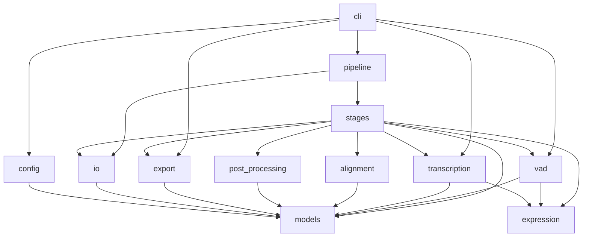

# Pipeline 目錄結構建議

## 1. 整體目錄結構

```
talking-parrot/
├── pyproject.toml             # 套件宣告與依賴（Factor II：明確宣告依賴）
├── mise.toml                  # 工具版本管理
├── fnox.toml
│
├── src/
│   └── talking_parrot/        # 主套件根目錄
│       ├── __init__.py
│       │
│       ├── cli.py             # 命令列入口點（Factor VII：Port Binding 的對應概念）
│       │                      # 負責讀取環境變數、建構所有依賴、啟動 Orchestrator
│       │
│       ├── config/            # 設定載入層（Factor III）
│       │   ├── __init__.py
│       │   ├── loader.py      # ConfigLoader：讀取並驗證 YAML → PipelineConfig
│       │   └── models.py      # PipelineConfig、VadConfig 等設定資料類別
│       │
│       ├── models/            # 共享資料模型（純資料，無行為）
│       │   ├── __init__.py
│       │   ├── context.py     # PipelineContext
│       │   ├── media.py       # MediaInfo
│       │   ├── vad.py         # VadSegment、RawVadFrame
│       │   ├── chunk.py       # Chunk
│       │   ├── transcription.py  # TranscriptionResult、TranscriptionMetrics、WordTimestamp
│       │   ├── subtitle.py    # Subtitle
│       │   └── project_file.py   # ProjectFile
│       │
│       ├── pipeline/          # Orchestration 層
│       │   ├── __init__.py
│       │   └── orchestrator.py   # PipelineOrchestrator
│       │
│       ├── vad/               # VAD 子系統
│       │   ├── __init__.py
│       │   ├── backend.py     # VADBackend 抽象介面
│       │   ├── ten_vad.py     # TenVADBackend
│       │   └── silero_vad.py  # SileroVADBackend
│       │
│       ├── transcription/     # 轉錄子系統
│       │   ├── __init__.py
│       │   ├── backend.py     # TranscriptionBackend 抽象介面
│       │   ├── factory.py     # TranscriptionBackendFactory（平台偵測與注入）
│       │   ├── faster_whisper.py   # FasterWhisperBackend
│       │   └── mlx_whisper.py      # MLXWhisperBackend
│       │
│       ├── alignment/         # Force Alignment 子系統
│       │   ├── __init__.py
│       │   ├── backend.py     # AlignmentBackend 抽象介面、AlignmentGranularity enum
│       │   ├── factory.py     # AlignmentBackendFactory（語言路由）
│       │   ├── english.py     # EnglishAlignmentBackend (granularity=WORD)
│       │   └── japanese.py    # JapaneseAlignmentBackend (granularity=CHARACTER)
│       │
│       ├── post_processing/   # 後處理子系統（粒度感知）
│       │   ├── __init__.py
│       │   ├── base.py              # SubtitleProcessor 抽象介面
│       │   ├── factory.py           # GranularityAwareProcessorFactory（抽象 + DefaultImpl）
│       │   ├── word_boundary.py     # WordBoundaryMergeProcessor / WordBoundarySplitProcessor
│       │   ├── character_boundary.py  # CharacterBoundaryMergeProcessor / CharacterBoundarySplitProcessor
│       │   ├── time_based.py        # TimeBasedMergeProcessor / TimeBasedSplitProcessor (fallback)
│       │   ├── dedup.py             # DedupSubtitleProcessor（重複字幕去除）
│       │   ├── japanese.py          # JapaneseFillerProcessor / JapaneseRepetitionProcessor
│       │   ├── split_policy.py      # SplitBoundaryPolicy protocol + LinearSplitBoundaryPolicy
│       │   │                        # + JapaneseSplitBoundaryPolicy
│       │   └── split_time_policy.py # SplitTimePolicy protocol + LinearSplitTimePolicy
│       │                            # + VadAlignedSplitTimePolicy
│       │
│       ├── stages/            # Stage 實作（每個 Stage 一個模組）
│       │   ├── __init__.py
│       │   ├── base.py                     # PipelineStage 抽象介面
│       │   ├── vad_stage.py
│       │   ├── chunking_stage.py
│       │   ├── transcription_stage.py
│       │   ├── hallucination_filter_stage.py  # HallucinationFilterStage
│       │   ├── alignment_stage.py
│       │   └── post_processing_stage.py
│       │
│       ├── io/                # I/O 工具
│       │   ├── __init__.py
│       │   ├── media_hasher.py      # MediaHasher
│       │   ├── audio_decoder.py     # 音訊解碼（ffmpeg 包裝）
│       │   ├── audio_reader.py      # AudioReader 介面 + ffmpeg 實作（區間懶讀 + LRU 快取）
│       │   ├── project_writer.py    # ProjectFileWriter
│       │   └── subtitle_export/     # 字幕輸出子系統
│       │       ├── __init__.py
│       │       ├── base.py          # SubtitleExporter 抽象介面
│       │       ├── factory.py       # SubtitleExporterFactory
│       │       ├── srt.py           # SRTExporter
│       │       └── webvtt.py        # WebVTTExporter
│       │
│       ├── expression/         # 安全表達式求值（共用）
│       │   ├── __init__.py
│       │   ├── base.py        # SafeExpressionEvaluator 抽象基底（白名單 AST walker）
│       │   ├── formula.py     # FormulaEvaluator（VAD composite score）
│       │   └── condition.py   # ConditionEvaluator（transcription condition）
│       │
│       └── logging_config.py  # 設定 structlog / logging 寫入 stdout（Factor XI）
│
├── tests/
│   ├── unit/                  # 各模組的單元測試
│   │   ├── stages/
│   │   ├── vad/
│   │   ├── transcription/
│   │   └── export/
│   └── integration/           # 端對端 Pipeline 測試
│       └── test_pipeline.py
│
├── test-samples/              # 迴歸測試用音訊樣本（已存在）
│   └── sample1/
│
├── scripts/                   # Admin 一次性工具（Factor XII）
│   ├── run_regression.py      # 迴歸測試執行腳本
│   └── analyze_audio.py       # 音訊特徵分析工具（對應 TODOs.md 第二項）
│
└── docs/                      # 架構文件（Obsidian Vault）
    ├── architecture/
    │   ├── pipeline-overview.md
    │   ├── pipeline-data-models.md
    │   ├── pipeline-module-interfaces.md
    │   ├── pipeline-directory-structure.md    ← 本文件
    │   ├── pipeline-post-processing-processors.md
    │   ├── ADR-0001-跨平台轉錄後端.md
    │   ├── ADR-0002-condition-評估器.md
    │   └── ADR-0003-對齊粒度與後處理策略.md
    ├── openspec/
    └── TODOs.md
```

---

## 2. 模組依賴方向



> 原則：依賴方向永遠由「高層模組」指向「抽象/模型層」，具體後端實作（`faster_whisper.py`、`mlx_whisper.py`）只被 `factory.py` 知曉，不被 Stage 直接 import。

---

## 3. 套件依賴宣告原則（Factor II）

`pyproject.toml` 中需明確區分依賴群組：

| 群組 | 內容 |
|------|------|
| `[project.dependencies]` | 所有平台共用的核心依賴（例：`pydantic`, `pyyaml`, `ffmpeg-python`） |
| `[project.optional-dependencies.faster-whisper]` | `faster-whisper`（Windows/Linux） |
| `[project.optional-dependencies.mlx]` | `mlx-whisper`（macOS） |
| `[project.optional-dependencies.dev]` | 測試、型別檢查、linting 工具 |

安裝時依平台選擇：
- macOS：`pip install "talking-parrot[mlx]"`
- Windows/Linux：`pip install "talking-parrot[faster-whisper]"`

---

## 4. 環境變數（Factor III）

| 變數名稱 | 用途 | 預設值 |
|---------|------|--------|
| `TRANSCRIPTION_BACKEND` | 覆蓋平台自動偵測（`faster-whisper` 或 `mlx-whisper`） | 無（自動偵測） |
| `MODEL_CACHE_DIR` | Whisper 模型檔案的快取目錄 | 平台預設快取目錄 |
| `LOG_LEVEL` | 日誌層級（`DEBUG`, `INFO`, `WARNING`, `ERROR`） | `INFO` |

---

## 5. Admin 腳本（Factor XII）

`scripts/` 目錄內的腳本應作為**獨立的一次性 Process** 執行，不嵌入 Pipeline 主程式：

```bash
# 迴歸測試
python scripts/run_regression.py --samples-dir test-samples/ --config config.yaml

# 音訊分析（對應 TODOs.md 第二項）
python scripts/analyze_audio.py --file test-samples/sample1/base.mp3
```

---

## 6. 相關文件

- [[pipeline-overview|系統架構總覽]]
- [[pipeline-module-interfaces|模組介面設計]]
- [[pipeline-post-processing-processors|後處理 Processor 家族]]

相關 spec：[[../openspec/specs/pipeline-foundation/spec|pipeline-foundation]]、[[../openspec/specs/pipeline-end-to-end-wiring/spec|pipeline-end-to-end-wiring]]
