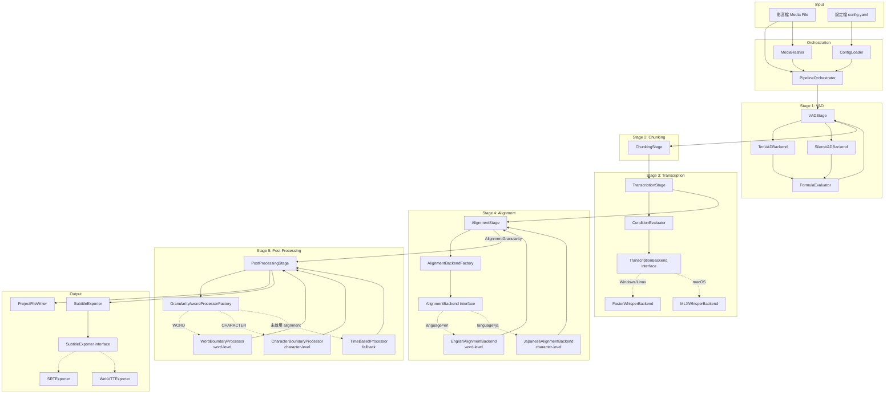

# Whisper 影音轉錄 Pipeline — 系統架構總覽

## 1. 系統目標

將任意影音檔透過可設定的多階段 Pipeline，輸出字幕檔（SRT / WebVTT）與包含完整中繼資料的專案檔（Project File）。所有處理行為皆由外部 YAML 設定檔驅動，不依賴任何硬編碼的平台或模型參數。

---

## 2. Pipeline 整體架構圖



> 實線箭頭代表資料流向；虛線箭頭代表介面與實作的對應關係（依賴倒置）。

---

## 3. 各模組職責說明

### 3.1 Orchestration 層

| 元件 | 職責 | SOLID 對應 |
|------|------|-----------|
| `PipelineOrchestrator` | 依序驅動各 Stage，傳遞 `PipelineContext`，不涉及任何業務邏輯 | SRP |
| `ConfigLoader` | 讀取並驗證 YAML 設定檔，回傳強型別的 `PipelineConfig` | SRP |
| `MediaHasher` | 計算影音檔的 SHA-256 hash，用於快取與追蹤 | SRP |

### 3.2 Stage 層

每個 Stage 實作同一個 `PipelineStage` 介面，接收 `PipelineContext` 並回傳更新後的 `PipelineContext`。

| Stage | 職責 |
|-------|------|
| `VADStage` | 協調多個 VAD Backend，套用 formula 計算合成分數，輸出 `VadSegment` 清單 |
| `ChunkingStage` | 根據 VAD 結果與 chunking 設定，將 Segment 合併為適合轉錄的 Chunk |
| `TranscriptionStage` | 逐一對 Chunk 執行轉錄，依 condition 決定使用哪個模型 |
| `AlignmentStage` | 依語言路由至對應的 `AlignmentBackend`（wav2vec2），細化時間軸並輸出 `AlignmentGranularity` |
| `PostProcessingStage` | 依 `AlignmentGranularity` 選擇後處理策略；alignment 未啟用時 fallback 至時間基礎處理器 |

### 3.3 Backend 介面層（DIP 實現）

```
VADBackend (interface)
  ├── TenVADBackend
  └── SileroVADBackend

TranscriptionBackend (interface)
  ├── FasterWhisperBackend   (Windows / Linux)
  └── MLXWhisperBackend      (macOS)

AlignmentBackend (interface)           ← 暴露 granularity: AlignmentGranularity
  ├── EnglishAlignmentBackend          (granularity=WORD)
  └── JapaneseAlignmentBackend         (granularity=CHARACTER)

SubtitleExporter (interface)
  ├── SRTExporter
  └── WebVTTExporter
```

後端實作由對應的 Factory 在啟動時依平台或語言設定注入，各 Stage 只依賴對應的抽象介面，不知道具體實作。`AlignmentBackend` 另外對外暴露 `granularity` 屬性，供 `PostProcessingStage` 的 `GranularityAwareProcessorFactory` 用來選擇正確的後處理策略。

### 3.4 Output 層

| 元件 | 職責 |
|------|------|
| `ProjectFileWriter` | 將 `ProjectFile` 資料結構序列化為 JSON 並寫入磁碟 |
| `SubtitleExporter` | 依選用的格式將最終字幕序列輸出為對應格式 |

---

## 4. 平台選擇決策

詳見 [[ADR-0001-跨平台轉錄後端]]。

---

## 5. SOLID / 12-Factor 對照

| 原則 | 如何實現 |
|------|---------|
| SRP | 每個 Stage、Backend、Exporter 只做一件事 |
| OCP | 新增 VAD Backend、Alignment Backend（新語言）或 Exporter 只需實作對應介面，不修改既有程式碼 |
| LSP | 所有 Backend 實作皆可被透明替換，呼叫方無需 if/isinstance |
| ISP | `VADBackend`、`TranscriptionBackend`、`SubtitleExporter` 各自只暴露必要方法 |
| DIP | `TranscriptionStage` 依賴 `TranscriptionBackend` 抽象，具體實作由工廠注入 |
| Factor III (Config) | 設定由外部 YAML 檔路徑傳入，不硬編碼 |
| Factor IV (Backing services) | VAD 模型、Whisper 模型視為可替換的附加資源 |
| Factor VI (Stateless) | 每個 Stage 無狀態，所有中間狀態存於 `PipelineContext` |
| Factor XI (Logs) | 所有日誌寫入 stdout，不由 Pipeline 管理日誌檔 |

---

## 6. 相關文件

- [[pipeline-data-models|Pipeline 資料模型]]
- [[pipeline-module-interfaces|模組介面設計]]
- [[pipeline-directory-structure|目錄結構]]
- [[ADR-0001-跨平台轉錄後端]]
- [[ADR-0002-condition-評估器]]
- [[ADR-0003-對齊粒度與後處理策略]]
