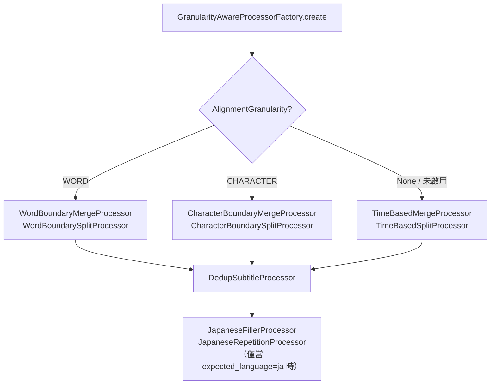
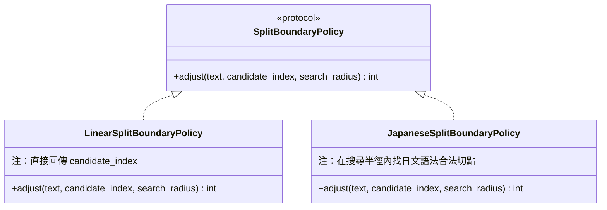
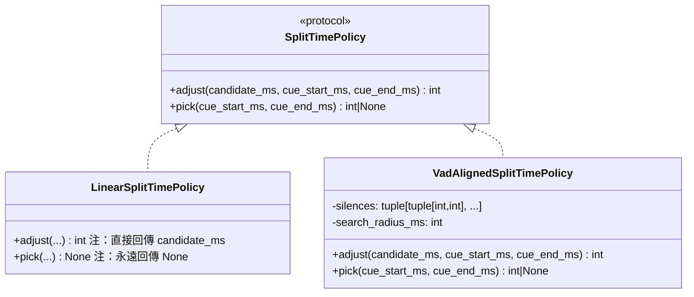

# 後處理 Processor 家族

`PostProcessingStage` 使用一組 `SubtitleProcessor` 的有序清單，依序對字幕進行合併、切分、品質過濾等操作。本文描述所有具體 Processor 的職責、設計決策，以及兩個可注入 Policy 物件（`SplitBoundaryPolicy`、`SplitTimePolicy`）的設計。

---

## 1. Processor 選擇架構（GranularityAwareProcessorFactory）

`GranularityAwareProcessorFactory` 依 `AlignmentGranularity` 決定 Processor 清單的組合：



> 工廠回傳的是**有序清單**，`PostProcessingStage` 依序呼叫每個 Processor 的 `process()` 方法。Dedup 與 Japanese 系列 Processor 在 Merge/Split 之後執行，以便對最終字幕序列做品質修整。

---

## 2. 核心 Processor 家族

### 2.1 WORD 粒度（英文等有空格語言）

| Processor | 職責 |
|-----------|------|
| `WordBoundaryMergeProcessor` | 合併相鄰過短字幕：間距 ≤ `merge_gap_threshold_ms`、合併後長度 ≤ `merge_max_duration_ms`、字元數 ≤ `max_line_length × max_lines_per_subtitle`；合併文字以單空格連接 |
| `WordBoundarySplitProcessor` | 切分過長字幕：超過 `split_max_duration_ms` 時，以 `AlignedToken` 的詞邊界找切點；時間切點由 `SplitTimePolicy` 決定 |

**合併條件（三者皆須滿足）：**
```
gap    = b.start_ms - a.end_ms  ≤ merge_gap_threshold_ms
span   = b.end_ms - a.start_ms  ≤ merge_max_duration_ms
length = len(a.text) + 1 + len(b.text)  ≤ max_line_length × max_lines_per_subtitle
```

---

### 2.2 CHARACTER 粒度（日文等無空格語言）

| Processor | 職責 |
|-----------|------|
| `CharacterBoundaryMergeProcessor` | 合併邏輯同 WORD 版本，但文字以**空字串**連接（無空格），適合 CJK 字幕 |
| `CharacterBoundarySplitProcessor` | 切分邏輯類似 WORD 版本；文字切點由 `SplitBoundaryPolicy` 決定（可注入 `JapaneseSplitBoundaryPolicy` 避免切在助動詞等詞法邊界），時間切點由 `SplitTimePolicy` 決定（可注入 `VadAlignedSplitTimePolicy` 對齊靜音區間） |

---

### 2.3 Fallback（未啟用 Alignment）

| Processor | 職責 |
|-----------|------|
| `TimeBasedMergeProcessor` | 不使用 `AlignedToken`；純依時間間距與字元長度合併，文字以單空格連接 |
| `TimeBasedSplitProcessor` | 不使用 `AlignedToken`；純依時間長度切分，切點由線性內插決定；時間切點由 `SplitTimePolicy` 決定 |

---

## 3. 品質修整 Processor

### 3.1 DedupSubtitleProcessor

移除連續出現的近似重複字幕，常見於 Whisper 在靜音段輸出重複幻覺。

**觸發條件（兩者皆須滿足）：**
- 相鄰字幕文字相似度 ≥ `dedup_similarity_threshold`（預設 0.9，使用 `difflib.SequenceMatcher.ratio()`）
- 相鄰字幕間距 ≤ `dedup_max_gap_ms`（預設 600ms）

合併結果：`start_ms = run[0].start_ms`、`end_ms = run[-1].end_ms`、`text = run[0].text`。

> 當 `config.dedup_enabled is False` 時，原樣回傳輸入序列。

---

### 3.2 JapaneseFillerProcessor

移除日文字幕中的開頭填充詞（例：あのー、えっと、まあ、なんか 等）。

- 只修改 `text`，不修改 `start_ms`、`end_ms`、`index`
- 移除後若 `text` 變為純空白，該字幕會被刪除並重新排號
- 填充詞清單可透過設定擴充；`config.japanese_filler_enabled is False` 時跳過

**預設填充詞清單：** `あの`、`あのー`、`えっと`、`えーと`、`えー`、`まあ`、`そのー`、`その`、`なんか`、`ね`

---

### 3.3 JapaneseRepetitionProcessor

折疊日文字幕中三個以上的連續相同字元至兩個（例：`あああああ` → `ああ`）。

- 設有擬聲詞白名單保護（例：`どきどき`、`わくわく`），在白名單內的重複不折疊
- 只修改 `text`，不修改時間戳；折疊後若 `text` 為空則刪除並重新排號
- `config.japanese_repetition_enabled is False` 時跳過

---

## 4. Policy 物件（可注入的行為策略）

Split 系列 Processor 在決定切點時依賴兩個 Protocol 物件，由工廠在建構時注入。

### 4.1 SplitBoundaryPolicy（文字切點）



`JapaneseSplitBoundaryPolicy` 的核心規則（`_is_valid` 判斷）：
- **不切**助動詞（まし、です、よう 等）與常見詞尾活用的中間
- 若在 `search_radius` 內找不到合法切點，退回 `candidate_index`

### 4.2 SplitTimePolicy（時間切點）



`VadAlignedSplitTimePolicy` 的行為：
- `adjust`：在 `[candidate_ms ± search_radius_ms]` 視窗內，尋找最接近 `candidate_ms` 的靜音中點；找不到時回傳 `candidate_ms`
- `pick`：直接在 `(cue_start_ms, cue_end_ms)` 區間內找最佳靜音中點（VAD driven 主路徑）；無合適靜音時回傳 `None`

> **VAD-driven 切分流程**：`CharacterBoundarySplitProcessor` 優先呼叫 `SplitTimePolicy.pick()` 取得靜音中點作為時間切點；若回傳 `None` 則退回線性內插，再以 `SplitTimePolicy.adjust()` 微調。文字切點則由 `SplitBoundaryPolicy.adjust()` 在 aligned tokens 倒推的 char_idx 上做語法 sanity check。

---

## 5. SOLID 對照

| 原則 | 如何實現 |
|------|---------|
| SRP | 每個 Processor 只做一件事（合併、切分、去重、填充詞清除、重複折疊） |
| OCP | 新增 Processor 只需實作 `SubtitleProcessor`，在工廠新增分支，不修改 Stage |
| LSP | 所有 Processor 皆可被透明替換，`PostProcessingStage` 不需知道具體型別 |
| ISP | `SubtitleProcessor` 只暴露 `process()` 一個方法 |
| DIP | Split Processor 依賴 `SplitBoundaryPolicy` / `SplitTimePolicy` 抽象，工廠負責注入具體實作 |

---

## 6. 相關文件

- [[pipeline-overview|系統架構總覽]]
- [[pipeline-module-interfaces|模組介面設計（§2.5 Policy 介面）]]
- [[pipeline-data-models|Pipeline 資料模型（PostProcessingConfig）]]
- [[ADR-0003-對齊粒度與後處理策略]]

相關 spec：[[../openspec/specs/character-boundary-processors/spec|character-boundary-processors]]、[[../openspec/specs/word-boundary-processors/spec|word-boundary-processors]]、[[../openspec/specs/time-based-processors/spec|time-based-processors]]、[[../openspec/specs/dedup-subtitle-processor/spec|dedup-subtitle-processor]]、[[../openspec/specs/japanese-postprocessors/spec|japanese-postprocessors]]、[[../openspec/specs/split-boundary-policy/spec|split-boundary-policy]]、[[../openspec/specs/split-time-policy/spec|split-time-policy]]、[[../openspec/specs/granularity-aware-processor-factory/spec|granularity-aware-processor-factory]]
