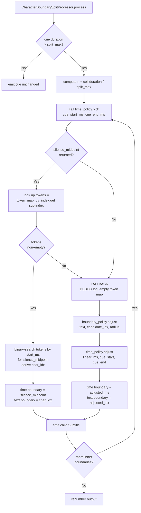

## Context

`CharacterBoundarySplitProcessor` is the CJK-path processor in the post-processing pipeline. When a cue exceeds `split_max_duration_ms` it splits the cue into `n` slices. Today the split location is chosen text-first: a linearly-interpolated character index is snapped to a grammatical boundary via `JapaneseSplitBoundaryPolicy`. The time boundary is then derived from that text index, also via linear interpolation plus an optional VAD snap (`VadAlignedSplitTimePolicy.adjust`).

Field testing on Japanese audio (`test-samples/sample1`) revealed that text-rule maintenance is fragile — every new grammatical edge case requires an additional rule entry in `japanese_split_no_leading_finals` or similar lists. The root cause is that the split decision starts from text and tries to recover acoustic grounding afterward. VAD silence gaps between `VadSegment`s are already available in the pipeline context and represent where the speaker actually paused. Aligned tokens (`AlignedToken.start_ms` / `end_ms`) from the alignment stage are also already threaded into the WORD path. Flipping to time → text for the CHARACTER path makes the acoustic evidence the primary signal.

## Goals / Non-Goals

**Goals:**

- Add `pick(cue_start_ms, cue_end_ms) -> int | None` to `SplitTimePolicy` protocol and both concrete classes.
- Extend `CharacterBoundarySplitProcessor` to accept `token_map_by_index` and to derive the text-cut index from aligned-token timestamps when a VAD silence is found inside the cue window.
- Extend `DefaultGranularityAwareProcessorFactory` to inject `token_map_by_index` into `CharacterBoundarySplitProcessor` on the CHARACTER path.
- Preserve the grammar-based fallback for cues without a qualifying VAD silence or without aligned tokens.

**Non-Goals:**

- Deleting `JapaneseSplitBoundaryPolicy` or its configuration fields (`japanese_split_no_split_units`, `japanese_split_no_leading_particles`, `japanese_split_no_leading_finals`). They remain the active fallback text-boundary strategy.
- Snapping the WORD path. `WordBoundarySplitProcessor` already uses aligned-token timestamps directly.
- Computing silences from raw VAD frame probabilities. The existing factory-derived gaps between `VadSegment`s remain the silence source.
- Changing the TIME-based fallback path (`granularity is None`). It has no aligned tokens to binary-search.
- Changing any alignment backend.
- Unparking or modifying the `extend-japanese-split-leading-finals` parked change.

## Decisions

### Decision 1: Factory threads token_map_by_index into CharacterBoundarySplitProcessor

`DefaultGranularityAwareProcessorFactory._build_token_map` already produces `dict[int, list[AlignedToken]]` for the WORD path. The CHARACTER path will now call the same static helper and pass the resulting map to `CharacterBoundarySplitProcessor` via a new `token_map_by_index` constructor keyword argument. This mirrors the WORD pattern exactly and satisfies DIP — the processor depends on the abstract token map shape, not on the factory internals.

Rationale: sharing one token-map builder avoids duplication (SRP) and keeps the factory as the single composition root (DIP). No new dependency is introduced.

### Decision 2: SplitTimePolicy gains a pick() method

`VadAlignedSplitTimePolicy` and `LinearSplitTimePolicy` both gain a `pick(cue_start_ms: int, cue_end_ms: int) -> int | None` method.

- `VadAlignedSplitTimePolicy.pick` returns the silence midpoint nearest the linear midpoint `(cue_start_ms + cue_end_ms) // 2` that lies strictly inside `(cue_start_ms, cue_end_ms)`, using the same radius and tie-breaking rules as `adjust`. Returns `None` when no qualifying silence exists.
- `LinearSplitTimePolicy.pick` always returns `None`.
- `SplitTimePolicy` protocol is extended with `pick` so callers can depend on the abstraction.
- The existing `adjust` method is unchanged on both classes and remains used by the fallback path.

Rationale: OCP — extending the protocol with `pick` is additive; no existing `adjust` callers change. ISP is preserved: `pick` and `adjust` are distinct operations, both small enough to live in a single protocol without creating a fat interface.

### Decision 3: VAD-driven algorithm — silence pick then token binary search

For each inner split boundary `i` in `[1, n-1]` on the CHARACTER path:

1. Call `silence_midpoint = time_policy.pick(cue_start_ms, cue_end_ms)`. One midpoint is sought per slice window; for `n > 2` the algorithm is applied per inner boundary.
2. If `silence_midpoint is not None` AND `tokens = token_map_by_index.get(sub.index, [])` is non-empty: binary-search `tokens` by `start_ms` to find the first token whose `start_ms >= silence_midpoint`. The character index becomes the cumulative character count up to that token position in the cue text. This is the new text cut index.
3. The time boundary for this slice is set to `silence_midpoint`.

This produces a text cut at the token whose start is nearest the acoustic pause — a time → text inversion.

### Decision 4: Fallback when pick() returns None or token map is empty

When `time_policy.pick()` returns `None` OR `token_map_by_index.get(sub.index, [])` is empty for the seed cue, `CharacterBoundarySplitProcessor` falls back to the existing algorithm:

- Text index: `boundary_policy.adjust(text, candidate_text_idx, search_radius)` (unchanged).
- Time boundary: `time_policy.adjust(linear_ms, cue_start_ms, cue_end_ms)` (unchanged, benefits from VAD snap when `VadAlignedSplitTimePolicy` is present).

The fallback preserves all invariants already specified (empty-text guard, DEBUG log for single-character cues, 1ms minimum slice collision guard). A DEBUG log entry SHALL be emitted when the fallback activates, identifying whether the cause was a missing silence or an empty token map.

### Decision 5: WORD path and TIME-based path are unchanged

`WordBoundarySplitProcessor` is unmodified. `TimeBasedSplitProcessor` is unmodified. The factory's WORD and `None` branches are unmodified. Only the CHARACTER branch is extended.

Rationale: scope containment (SRP). The WORD processor already uses token timestamps directly, making a `pick()`-based approach redundant. The time-based path has no aligned tokens.

### Decision 6: Data-flow diagram

The following diagram shows the CHARACTER-path split decision after this change, contrasted with the existing fallback.

**SOLID / 12-Factor alignment:**

- SRP: `CharacterBoundarySplitProcessor` owns the split algorithm; `SplitTimePolicy` owns silence selection; `DefaultGranularityAwareProcessorFactory` owns composition.
- OCP: `pick()` is added to the protocol without modifying existing `adjust` callers.
- LSP: both `pick()` implementations satisfy the same contract (`int | None`, no side effects).
- ISP: `pick` and `adjust` are the only two methods; callers that only use `adjust` are unaffected.
- DIP: `CharacterBoundarySplitProcessor` depends on `SplitTimePolicy` (protocol) and `dict[int, list[AlignedToken]]` (plain data), never on concrete classes.
- Factor VI (Processes): no state is held between cues; the token map is passed in at construction time.
- Factor XI (Logs): all diagnostic output goes through `structlog` to stdout.

## Risks / Trade-offs

- **Multiple silences inside one cue:** `pick()` returns only the best single midpoint (nearest to the linear midpoint). For `n > 2` slices each boundary independently calls `pick()` on the full cue window, so the same silence may win for multiple boundaries. A 1ms-minimum collision guard (already present) prevents degenerate output; a DEBUG log entry makes this observable.
- **Token coverage gaps:** If aligned tokens cover only a subset of the cue text (e.g., alignment partial failure), the binary search may produce a cut at the first or last token rather than a central point. The fallback (empty token map check) does not protect against partial coverage; this is accepted as a known trade-off for this iteration.
- **No change to `CharacterBoundaryMergeProcessor`:** Merge decisions remain purely time/length-based. This is correct — merging happens before splitting, so no token map is needed there.
