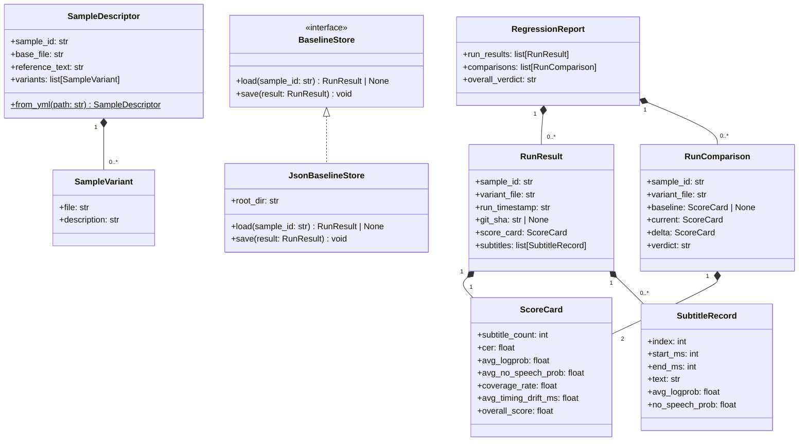
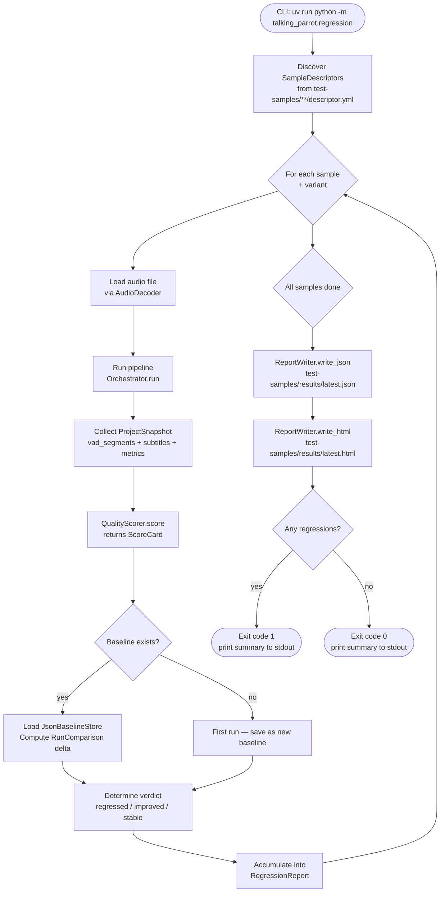

# 01 — Regression Harness

[[README|Back to overview]] | Related: [[shared-architecture]]

---

## Goal

Provide an automated harness that runs the full talking-parrot pipeline against every audio file in `test-samples/`, collects structured quality metrics (subtitle text, confidence, timing), persists the results, and reports whether quality improved or regressed relative to a stored baseline.

---

## Scope

- Discover and iterate over all samples described by `descriptor.yml` files under `test-samples/`
- Run the full pipeline (`pipeline/orchestrator.py`) programmatically for each sample variant
- Collect `ScoreCard` per run: subtitle count, character error rate (CER) vs reference text, avg confidence, coverage rate, timing drift
- Persist results as JSON baselines under `test-samples/<sample>/baseline.json`
- Produce a human-readable HTML summary report
- Expose a `uv run python -m talking_parrot.regression` CLI entry point

---

## Non-Goals

- Does not replace the unit/integration test suite (`tests/`)
- Does not stream audio or render video — read-only file processing
- Does not implement its own ASR model; uses the existing pipeline
- Does not track Git SHAs automatically (callers must tag runs if desired)

---

## Dependencies

| Dependency | Direction | Notes |
|---|---|---|
| `shared/project_snapshot.py` | upstream | `ProjectSnapshot` value object |
| `shared/metrics.py` | upstream | `ScoreCard`, `CueDiff` |
| `pipeline/orchestrator.py` | upstream | existing — called as a library, not subprocess |
| `test-samples/*/descriptor.yml` | data | existing — defines sample + reference text |

---

## Data Model

---

## Process Flow

---

## Module Breakdown

| Module | Responsibility (SRP) |
|---|---|
| `regression/runner.py` | Discovers samples, invokes pipeline, collects `ProjectSnapshot` per run |
| `regression/scorer.py` | Pure function: `ProjectSnapshot + SampleDescriptor → ScoreCard`; no I/O |
| `regression/reporter.py` | Pure function: `RegressionReport → JSON str + HTML str`; no I/O |
| `regression/baseline.py` | `BaselineStore` interface + `JsonBaselineStore` implementation |
| `regression/cli.py` | Argument parsing, env-var injection, wires runner → scorer → reporter → baseline |

> [!tip] OCP in practice
> New scoring dimensions (BLEU, word error rate) are added by implementing a new class satisfying `QualityScorerPort`, then registering it in `cli.py`. No existing scorer is modified.

---

## CER Calculation Note

Character Error Rate (CER) = edit distance between concatenated output text and `descriptor.yml` `text` field, normalised by reference length. This requires no new dependency — Python stdlib `difflib.SequenceMatcher` is sufficient.

> [!note] Suggested new dependency
> If WER (word error rate) is later required, `jiwer` is the standard choice. Not needed for the initial milestone.

---

## Implementation Milestones

1. **M1 — Shared layer** `shared/project_snapshot.py` + `shared/metrics.py`: define frozen dataclasses, no logic.
2. **M2 — Sample discovery** `regression/runner.py`: `SampleDescriptor.from_yml`, file glob, variant iteration.
3. **M3 — Scorer** `regression/scorer.py`: implement CER, confidence aggregation, coverage rate — fully unit-testable without audio files.
4. **M4 — Baseline store** `regression/baseline.py`: `JsonBaselineStore` — reads/writes `baseline.json`.
5. **M5 — Reporter** `regression/reporter.py`: JSON + minimal HTML output.
6. **M6 — CLI + integration** wire everything; add `[project.scripts]` entry in `pyproject.toml`.

---

## Risks & Trade-offs

| Risk | Mitigation |
|---|---|
| Pipeline run time per sample is long (model loading) | Cache model instance across samples within one CLI invocation |
| Reference text in `descriptor.yml` may be incomplete | CER is advisory; human review is still required for semantic quality |
| `test-samples/` audio files not committed to Git (size) | Harness skips missing files with a warning and reports them in the HTML output |
| Baseline drift on model upgrade | Provide `--reset-baseline` flag to overwrite; require explicit operator decision |

---

## Spectra Proposal Suggestion

Split into two changes:
1. `/spectra-propose` **shared-layer** — `ProjectSnapshot`, `ScoreCard`, `BaselineStore` (no pipeline changes)
2. `/spectra-propose` **regression-runner** — runner, scorer, reporter, CLI (depends on shared-layer change)
