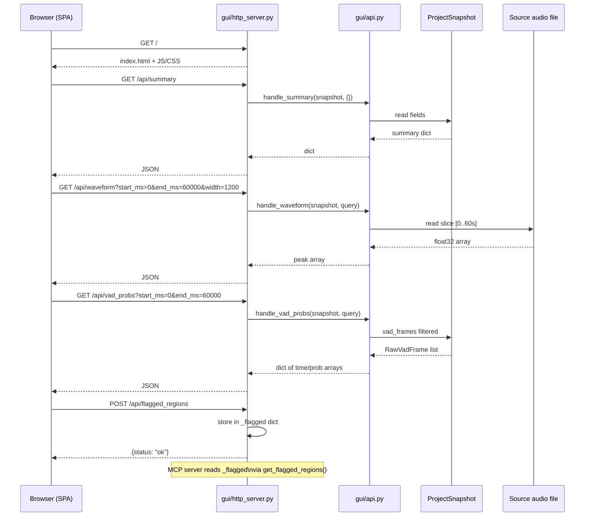

# 02 — Analysis GUI (Debug Timeline Viewer)

[[README|Back to overview]] | Related: [[shared-architecture]]

---

## Goal

Provide a browser-based visual tool that lets a developer load a `.tp` project file, inspect audio features (waveform, energy, VAD probabilities) on a scrollable timeline, view VAD segments, play back the audio/video, and read the transcribed subtitles overlaid on the timeline — enabling rapid identification of transcription problems without writing ad-hoc scripts.

---

## Design Borrowing from `audio2subtitle`

The audio2subtitle GUI (`mcp/debug_ui/`) is explicitly liked by the user. The talking-parrot GUI adopts the same architecture:

- **Vanilla JS SPA** served from a Python `http.server`-based local HTTP server — no build step, no npm, no Electron
- **Canvas-based timeline** with waveform + VAD overlay + subtitle track lanes
- **`/api/*` endpoints** served by `gui/api.py` (pure functions: `ProjectSnapshot + query params → dict`)
- **Audio/video streaming** via `Range`-header-aware byte streaming (for `<video>` element seeking)
- **Flagged-region bridge**: the user can paint a time region in the GUI and it becomes available to the MCP server tool `get_flagged_regions`

---

## Scope

- Waveform visualization (peak/RMS per pixel column)
- VAD probability overlay (Silero prob, TEN-VAD prob, composite)
- VAD segment bands (colored rectangles on timeline)
- Subtitle track: cue boxes with text, color-coded by `quality_status` / confidence
- Audio/video playback with playhead scrubbing
- Subtitle rendering as WebVTT track on `<video>` element
- Region selection → flag for MCP analysis
- Detail panel: click a cue → show aligned tokens, logprob, no-speech-prob
- `uv run python -m talking_parrot.gui <path-to-project.tp>` entry point

---

## Non-Goals

- No editing or mutation of the project file
- No ASR re-run from the GUI
- No waveform editing / audio export (out of scope for this tool)
- No authentication or multi-user access (local developer tool only)

---

## Dependencies

| Dependency | Direction | Notes |
|---|---|---|
| `shared/project_snapshot.py` | upstream | `ProjectSnapshot` |
| `shared/snapshot_loader.py` | upstream | `SnapshotLoader` interface |
| `mcp/server.py` | sibling (optional) | shares flagged-region in-process dict when both run together |
| Python stdlib `http.server` | runtime | no new dep |
| Python stdlib `wave` / `struct` | runtime | WAV encoding for `/api/audio` |

> [!note] Suggested new dependency
> `numpy` is already used in the pipeline for audio processing. The waveform downsampling endpoint (`/api/waveform`) will use it. No new dependency required.

---

## API Specification

All endpoints are `GET`, return `application/json` unless noted, and are served at `http://127.0.0.1:<port>/api/...`.

```
GET /api/summary
  Response:
    duration_ms: integer
    sample_rate: integer
    rms_mean: float
    rms_peak: float
    subtitle_count: integer
    quality_distribution: { accepted: int, low_confidence: int }
    detected_language: string
    hotspots: [{time_ms: int, type: string, text?: string}]

GET /api/waveform?start_ms=0&end_ms=60000&width=1200
  Response: [{peak_pos: float, peak_neg: float}]   # length == width

GET /api/vad_probs?start_ms=0&end_ms=60000&downsample=4
  Response:
    times_ms: [int]
    silero: [float]
    ten_vad: [float]
    composite: [float]

GET /api/vad_segments?start_ms=0&end_ms=60000
  Response: [{start_ms: int, end_ms: int, composite_score: float}]

GET /api/subtitles?start_ms=0&end_ms=60000
  Response:
    [{index: int, start_ms: int, end_ms: int, text: str,
      avg_logprob: float, no_speech_prob: float, quality_status: str}]

GET /api/subtitle_tokens?index=5
  Response:
    subtitle: {index, start_ms, end_ms, text, avg_logprob, no_speech_prob}
    tokens: [{word: str, start_ms: float, end_ms: float, score: float}]

GET /api/audio?start_ms=0&end_ms=5000
  Content-Type: audio/wav
  Body: 16-bit PCM WAV bytes (mono, project sample rate)

GET /api/video_info
  Response:
    is_video: bool
    container: string | null
    browser_playable: bool
    mime_type: string
    duration_ms: integer

GET /api/video
  Content-Type: <mime>
  Headers: Range (byte serving for seekable playback)

GET /api/flagged_regions
  Response:
    status: "ok" | "empty"
    regions: [{start_ms: int, end_ms: int, label?: str}]

POST /api/flagged_regions
  Body: {regions: [{start_ms: int, end_ms: int, label?: str}]}
  Response: {status: "ok"}
```

---

## Data Flow



---

## Frontend Module Breakdown

| JS module | Responsibility |
|---|---|
| `app.js` | Bootstrap: fetch summary, initialise panels, wire events |
| `timeline.js` | Canvas rendering loop, scroll/zoom state, coordinate mapping |
| `waveform.js` | Fetch waveform data, draw peak/RMS on canvas layer |
| `vad-overlay.js` | Fetch VAD probs + segments, draw probability curve + segment bands |
| `subtitle-track.js` | Fetch subtitle list, draw cue boxes, colour-code by quality |
| `video-player.js` | `<video>` element management, WebVTT subtitle track injection, playhead sync |
| `api-client.js` | All `fetch` calls; centralised URL construction and error handling |

---

## Backend Module Breakdown

| Module | Responsibility (SRP) |
|---|---|
| `gui/http_server.py` | HTTP lifecycle (bind, serve, Range headers, static files, thread management) |
| `gui/api.py` | Pure routing: `path + query + ProjectSnapshot → dict/bytes`; no HTTP knowledge |
| `gui/cli.py` | Arg parsing, env-var resolution, wires loader → server → optional MCP co-start |

---

## Implementation Milestones

1. **M1 — HTTP skeleton** `http_server.py` + static `index.html`: serves a blank page at `localhost:<port>`.
2. **M2 — Summary + waveform** `/api/summary` + `/api/waveform`; basic canvas waveform draw.
3. **M3 — VAD overlay** `/api/vad_probs` + `/api/vad_segments`; probability curve + segment bands.
4. **M4 — Subtitle track** `/api/subtitles` + `/api/subtitle_tokens`; cue boxes + detail panel.
5. **M5 — Playback** `/api/audio` + `/api/video` + `/api/video_info`; `<video>` + WebVTT injection.
6. **M6 — Region flagging** `POST /api/flagged_regions`; region-select brush + MCP bridge.

---

## Risks & Trade-offs

| Risk | Mitigation |
|---|---|
| Browser cannot decode `.mkv` / `.avi` directly | `/api/video_info` exposes `browser_playable` flag; GUI falls back to audio-only when false |
| Large audio files slow waveform load | `/api/waveform` accepts `width` param; always downsamples to pixel count |
| Canvas performance on long recordings | Virtualised rendering: only draw visible viewport, redraw on scroll |
| Port collision with MCP server | GUI binds a separate port; both are configurable via CLI flags / env vars |

---

## Spectra Proposal Suggestion

Split into three changes:
1. `/spectra-propose` **gui-backend** — `http_server.py`, `api.py`, all `/api/*` endpoints, CLI
2. `/spectra-propose` **gui-frontend-timeline** — waveform, VAD overlay, subtitle track
3. `/spectra-propose` **gui-playback** — video/audio player, WebVTT track, region flagging
