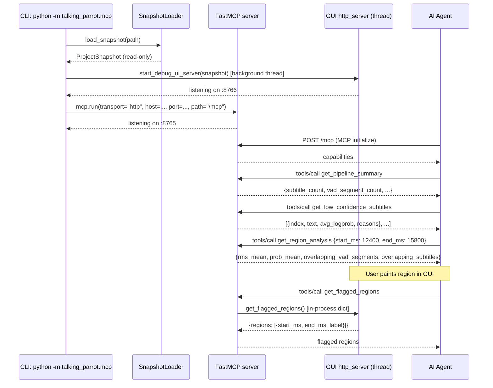
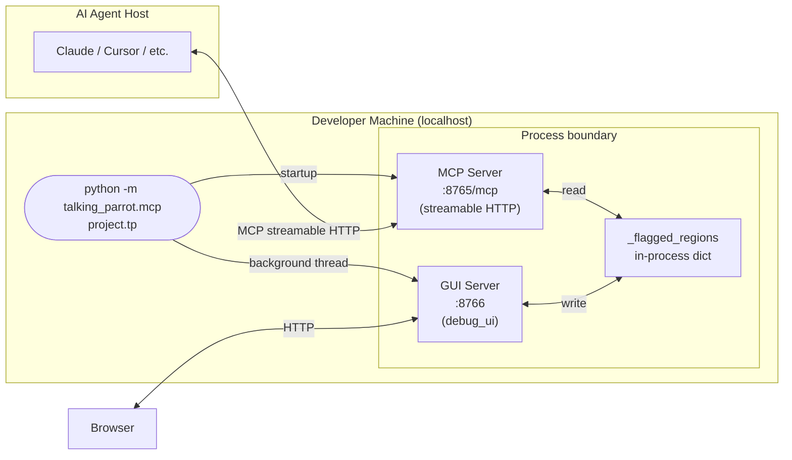

# 03 — MCP Server

[[README|Back to overview]] | Related: [[shared-architecture]]

---

## Goal

Expose a Model Context Protocol (MCP) server that lets an AI agent (Claude, Cursor, etc.) query a loaded `.tp` project file's pipeline intermediates — VAD frames, transcription results, subtitle quality metrics, coverage gaps — to help diagnose transcription problems without requiring the agent to read raw binary files.

---

## Design Principle: Streamable HTTP is the Default

> [!important]
> Unlike audio2subtitle (where `stdio` is the default and `--transport http` is opt-in), talking-parrot's MCP server **defaults to streamable HTTP**. `stdio` is available as an explicit opt-in for environments that require it (e.g. Claude Desktop direct integration).
>
> Rationale: streamable HTTP is the more capable and forward-compatible transport; it allows the GUI and MCP server to co-exist as separate processes; it aligns with Factor VII (services exposed via port binding).

---

## Scope

- Load a `.tp` project file at startup into a read-only `ProjectSnapshot`
- Expose MCP tools covering: pipeline summary, VAD segments, VAD frame probabilities, subtitles (with quality fields), aligned tokens, coverage gaps, postprocess diff, region-level analysis
- Expose MCP resources for structured data access (project config, audio metadata)
- Co-start the GUI Debug Timeline Viewer in a background thread (optional, disable via `--no-ui`)
- Provide `get_flagged_regions` tool that reads regions painted in the GUI
- `uv run python -m talking_parrot.mcp <path-to-project.tp>` entry point

---

## Non-Goals

- No mutation of the project file
- No re-running the pipeline via MCP
- No authentication beyond localhost binding (local developer tool)
- No multi-tenant project loading (one project per server process)

---

## Dependencies

| Dependency | Direction | Notes |
|---|---|---|
| `shared/project_snapshot.py` | upstream | `ProjectSnapshot` value object |
| `gui/http_server.py` | sibling (optional) | GUI co-start; shares `_flagged_regions` dict |
| `fastmcp` | external | **Suggested new dependency**: `fastmcp`; reason: already proven in audio2subtitle, provides decorator-based tool registration and handles both stdio and streamable HTTP transports transparently |

> [!note] Suggested new dependency
> `fastmcp` — reason: zero-boilerplate MCP tool registration, handles streamable HTTP + stdio transports. Already used in audio2subtitle. Version: latest stable at time of implementation.

---

## Tool Interface Catalogue

All tools are read-only. Parameter types use Python type-hint notation.

```yaml
# Overview
get_pipeline_summary() -> dict
  "Overview: subtitle count, VAD segment count, avg confidence, detected language, duration"

get_pipeline_config(section: str | None = None) -> dict
  "Full config snapshot or a named section (vad, transcription, post_processing)"

get_audio_info() -> dict
  "duration_ms, sample_rate, rms_mean, rms_peak"

# VAD
get_vad_segments(start_ms: int | None, end_ms: int | None,
                 offset: int = 0, limit: int = 50) -> dict
  "Paginated list of VadSegments with composite_score"

get_vad_frame_probs(start_ms: int, end_ms: int,
                    downsample: int = 1) -> dict
  "Per-frame silero_prob, ten_vad_prob, composite for a time window"

# Subtitles
get_subtitles(start_ms: int | None, end_ms: int | None,
              quality_status: str | None,
              min_logprob: float | None,
              max_no_speech_prob: float | None,
              offset: int = 0, limit: int = 50) -> dict
  "Paginated subtitle list with quality fields"

get_subtitle_tokens(subtitle_index: int) -> dict
  "Aligned tokens (word, start_ms, end_ms, score) for one subtitle cue"

get_low_confidence_subtitles(offset: int = 0, limit: int = 50) -> dict
  "Subtitles below configured logprob / no-speech-prob thresholds, with failure reasons"

# Diagnostics
get_postprocess_diff(start_ms: int | None, end_ms: int | None,
                     offset: int = 0, limit: int = 50) -> dict
  "Subtitles present before post-processing but absent after (removed cues)"

find_coverage_gaps(start_ms: int | None, end_ms: int | None,
                   min_gap_ms: int = 500,
                   offset: int = 0, limit: int = 50) -> dict
  "VAD-covered regions with no corresponding subtitle"

get_region_analysis(start_ms: int, end_ms: int) -> dict
  "RMS energy, VAD prob stats, overlapping cues/segments for a time window"

# GUI bridge
get_flagged_regions() -> dict
  "Regions painted by user in the GUI Debug Timeline Viewer"
```

---

## Resource Interface Catalogue

MCP Resources provide structured read-only data accessible by URI.

```yaml
talking-parrot://project/config
  "Full pipeline configuration as JSON"

talking-parrot://project/audio-info
  "Audio metadata (duration, sample rate, RMS stats)"

talking-parrot://project/subtitles
  "All final subtitle cues as JSON array"

talking-parrot://project/vad-segments
  "All VAD speech segments as JSON array"
```

---

## Process Flow



---

## Deployment Topology



---

## Authentication & Deployment Considerations

| Concern | Design decision |
|---|---|
| **Auth** | No auth required — server binds to `127.0.0.1` (loopback) by default; `--host` flag may override for LAN use at user's risk |
| **TLS** | Not provided by the server; TLS termination is the responsibility of an external reverse proxy if needed |
| **Port** | Default MCP port injected via `TALKING_PARROT_MCP_PORT` env var (Factor III), falling back to `8765` |
| **GUI port** | Default GUI port injected via `TALKING_PARROT_GUI_PORT` env var, falling back to `8766` |
| **Startup** | Process starts fast (Factor IX): project file loaded synchronously; no lazy background loading that could race with tool calls |
| **Graceful shutdown** | SIGINT/SIGTERM: background GUI thread is a daemon thread and exits with the main process |

---

## Module Breakdown

| Module | Responsibility (SRP) |
|---|---|
| `mcp/server.py` | `FastMCP` instance, all `@mcp.tool()` decorations, `@mcp.resource()` decorations, entry point `main()` |
| `mcp/cli.py` | Argument parsing, env-var resolution, wires loader → optional GUI → `mcp.run()` |

> [!tip] ISP in practice
> Each tool is a separate decorated function. The agent depends only on the tools it calls. No tool is bundled with unrelated responsibilities.

---

## Implementation Milestones

1. **M1 — Shared layer** (same as regression M1): `ProjectSnapshot` + `SnapshotLoader`.
2. **M2 — Server skeleton** `mcp/server.py`: `FastMCP` instance, streamable HTTP default, `get_pipeline_summary` only; verify with `curl`.
3. **M3 — VAD tools** `get_vad_segments`, `get_vad_frame_probs`.
4. **M4 — Subtitle tools** `get_subtitles`, `get_subtitle_tokens`, `get_low_confidence_subtitles`.
5. **M5 — Diagnostic tools** `get_postprocess_diff`, `find_coverage_gaps`, `get_region_analysis`.
6. **M6 — GUI co-start + flagged regions** wire GUI thread, `get_flagged_regions` tool.
7. **M7 — Resources** `talking-parrot://project/*` resource URIs.

---

## Risks & Trade-offs

| Risk | Mitigation |
|---|---|
| `fastmcp` API surface is evolving | Pin to a specific version in `pyproject.toml`; review on upgrade |
| Port collision between MCP server and GUI | Pre-flight port check at startup; clear error message and `sys.exit(1)` on collision |
| Large project files slow startup | `SnapshotLoader` reads once synchronously; no streaming required at this scale |
| Agent sends time ranges in wrong units (seconds vs ms) | Tool docstrings explicitly state unit; consider a `TimeRange` value object that validates |

---

## Spectra Proposal Suggestion

Split into two changes:
1. `/spectra-propose` **mcp-core** — `server.py`, all tools M2–M5, CLI (depends on shared-layer)
2. `/spectra-propose` **mcp-gui-bridge** — GUI co-start, `get_flagged_regions`, resource URIs (depends on gui-backend change)
