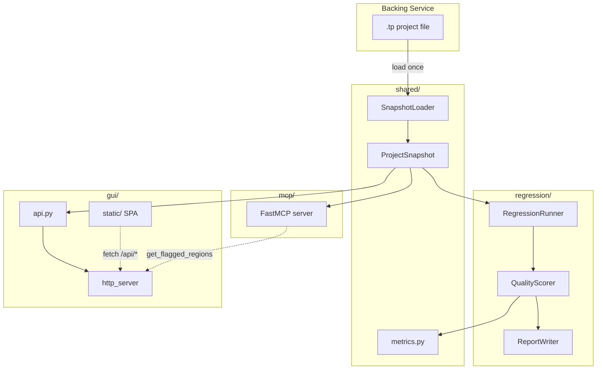

# Quality & Tooling — Planning Overview

This directory contains architecture and design documents for the three quality-and-tooling initiatives listed in [[TODOs|TODOs.md]] (「品質與工具」section).

---

## Task Index

| # | Document | Core design decision |
|---|---|---|
| 1 | [[01-regression-harness]] | Pipeline output is scored via CER + confidence metrics against a stored JSON baseline; exit code 1 on regression |
| 2 | [[02-analysis-gui]] | Browser SPA over local Python HTTP server (same architecture as audio2subtitle GUI the user likes) |
| 3 | [[03-mcp-server]] | FastMCP with **streamable HTTP as default transport**; co-starts GUI in background thread |
| — | [[shared-architecture]] | `shared/` sub-package owns `ProjectSnapshot` + `ScoreCard`; regression, GUI, and MCP all depend on it, never on each other |

---

## Architecture Decisions

| ADR | Decision |
|---|---|
| [[adr-0001-gui-browser-spa]] | Browser SPA over local HTTP chosen over Qt / Jupyter |
| [[adr-0002-mcp-streamable-http-default]] | Streamable HTTP is default MCP transport (stdio is opt-in) |

---

## Shared Architecture at a Glance



---

## Proposed Directory Tree (additions to `src/talking_parrot/`)

```
src/talking_parrot/
├── shared/          ← new: ProjectSnapshot, ScoreCard, SnapshotLoader
├── regression/      ← new: runner, scorer, reporter, baseline, cli
├── gui/             ← new: http_server, api, cli, static/
└── mcp/             ← new: server, cli
```

Full detail: [[shared-architecture#2. Proposed Directory Tree]]

---

## Suggested Spectra Change Order

```
1. shared-layer          → ProjectSnapshot + ScoreCard + BaselineStore
                           (blocks: regression, gui, mcp)

2a. regression-runner    → runner + scorer + reporter + CLI
2b. gui-backend          → http_server + api + all /api/* endpoints + CLI
    (2a and 2b can run in parallel once shared-layer lands)

3a. mcp-core             → FastMCP tools (summary, VAD, subtitles, diagnostics) + CLI
    (depends on shared-layer; can start parallel with gui-backend)

4a. gui-frontend-timeline → waveform + VAD overlay + subtitle track
4b. gui-playback          → video/audio player + WebVTT + region flagging

5.  mcp-gui-bridge        → GUI co-start + get_flagged_regions + resources
    (depends on gui-backend + mcp-core)
```

> [!tip]
> Start with `/spectra-propose shared-layer` — it unblocks all three tasks simultaneously.

---

## SOLID & 12-Factor Compliance Summary

All three tasks share the same compliance posture documented in [[shared-architecture#5. SOLID & 12-Factor Alignment]].

Key constraints to remember during implementation:

- **No hardcoded ports, hosts, or paths** — all via env vars or CLI flags (Factor III)
- **No log files written by the app** — `logging` to stdout only (Factor XI)
- **No state mutation after startup** — `ProjectSnapshot` is frozen (Factor VI)
- **No fat interfaces** — each MCP tool is a separate function; each API endpoint is a separate function (ISP)
