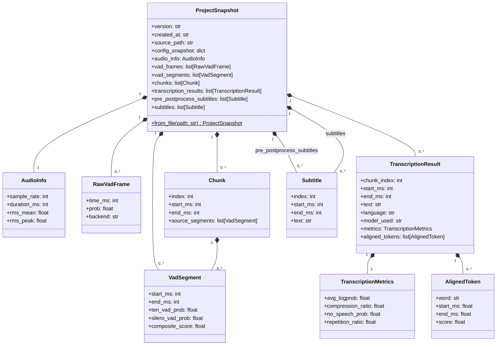
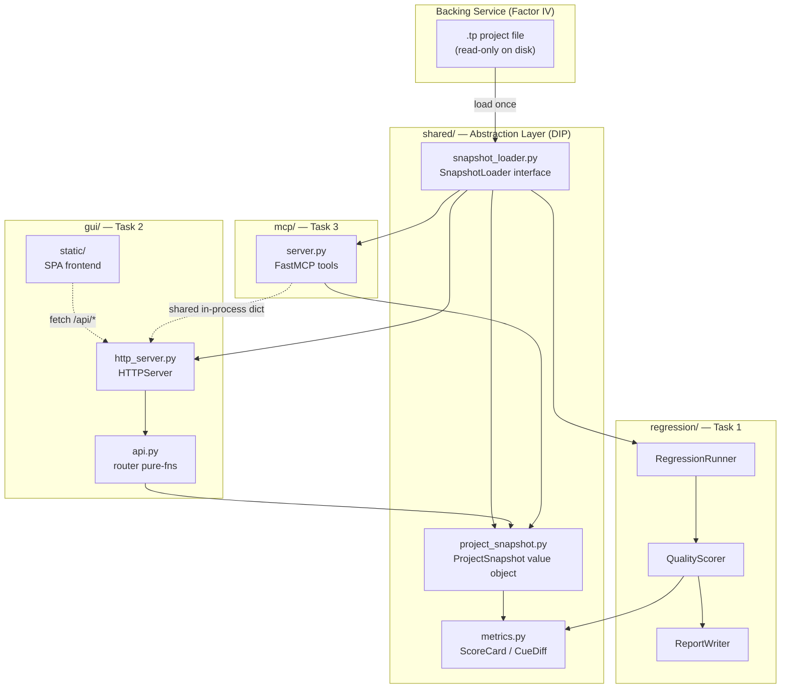

# Shared Architecture — Quality & Tooling

This document defines the shared data models, module layout, and directory-tree proposal used across all three quality-and-tooling initiatives:

- [[01-regression-harness|Regression Harness]]
- [[02-analysis-gui|Analysis GUI]]
- [[03-mcp-server|MCP Server]]

---

## 1. Borrowings from `audio2subtitle`

| Design element | audio2subtitle | talking-parrot adaptation |
|---|---|---|
| **Project file as single source of truth** | `.a2s` contains every pipeline intermediate | `.tp` (or `.json`) likewise carries `vad_frames`, `transcription_results`, `subtitles`, config snapshot |
| **Read-only `ProjectData` value object** | `ProjectData` frozen dataclass loaded once | Extend `ProjectFile` into `ProjectSnapshot` with all intermediates |
| **GUI as browser-based static SPA over local HTTP** | `debug_ui/` with vanilla JS + `<canvas>` timeline | Same approach — no Electron, no Qt, no new GUI framework dependency |
| **MCP via `FastMCP`** | `FastMCP("audio2subtitle-debug")` | `FastMCP("talking-parrot-debug")` with identical tool shape |
| **Streamable HTTP first** | `--transport http` option with `stdio` fallback | Streamable HTTP is the **default** (stdin/stdout is opt-in) |
| **Flagged-region bridge (GUI → MCP)** | Shared in-process dict via `http_server.get_flagged_regions()` | Same pattern |

> [!warning] What NOT to copy
> audio2subtitle has a global mutable `_project` variable for server state. In talking-parrot the MCP server must load the project at startup into a **read-only** module-level value, never reassigning it after init — satisfying Factor VI (stateless processes; state lives in backing services, not in-process mutation beyond startup).

---

## 2. Proposed Directory Tree

```
src/talking_parrot/
├── models/                  # existing — no changes
│   ├── project_file.py      # extend → ProjectSnapshot
│   ├── subtitle.py
│   ├── transcription.py
│   └── vad.py
│
├── shared/                  # NEW — shared layer (SRP: one reason to exist per module)
│   ├── __init__.py
│   ├── project_snapshot.py  # ProjectSnapshot dataclass + load_snapshot()
│   ├── snapshot_loader.py   # I/O adapter: reads .tp file, returns ProjectSnapshot
│   └── metrics.py           # ScoreCard, CueDiff, MetricBundle value objects
│
├── regression/              # NEW — Task 1
│   ├── __init__.py
│   ├── runner.py            # RegressionRunner (orchestrates full pipeline per sample)
│   ├── scorer.py            # QualityScorer (produces ScoreCard from output vs reference)
│   ├── reporter.py          # ReportWriter (writes JSON + HTML summary)
│   └── cli.py               # uv run python -m talking_parrot.regression
│
├── gui/                     # NEW — Task 2
│   ├── __init__.py
│   ├── http_server.py       # HTTP server serving static/ + /api/*
│   ├── api.py               # API request router (pure functions, ProjectSnapshot → dict)
│   ├── cli.py               # uv run python -m talking_parrot.gui
│   └── static/
│       ├── index.html
│       ├── css/
│       │   └── style.css
│       └── js/
│           ├── app.js
│           ├── timeline.js
│           ├── waveform.js
│           ├── vad-overlay.js
│           ├── subtitle-track.js
│           ├── video-player.js
│           └── api-client.js
│
└── mcp/                     # NEW — Task 3
    ├── __init__.py
    ├── server.py             # FastMCP tools + entry point
    └── cli.py                # uv run python -m talking_parrot.mcp
```

> [!note] Dependency rule (DIP)
> `regression/`, `gui/`, and `mcp/` all import from `shared/` only. None of them import from each other.

---

## 3. Shared Data Model



> [!info] Relation to existing models
> `RawVadFrame`, `VadSegment`, `Chunk`, `TranscriptionResult`, and `Subtitle` already exist in `src/talking_parrot/models/`. `ProjectSnapshot` replaces (extends) the current `ProjectFile`, promoting it to carry all pipeline intermediates. The existing `ProjectFile` should be kept as the on-disk serialisation DTO; `ProjectSnapshot` is the richer in-memory view.

---

## 4. Component Interaction Overview



---

## 5. SOLID & 12-Factor Alignment

| Principle | How it is satisfied |
|---|---|
| **SRP** | `snapshot_loader` only reads; `scorer` only scores; `reporter` only writes; `api.py` only routes |
| **OCP** | New scorers (e.g. CER, BLEU) are added as new classes implementing `QualityScorerPort`, not by editing existing ones |
| **LSP** | `SnapshotLoader` protocol: any implementation (from file, from DB, from fixture) is safely substitutable |
| **ISP** | `gui/api.py` exposes one function per endpoint; MCP tools are individual decorated functions — no fat interfaces |
| **DIP** | `RegressionRunner`, GUI `api.py`, and MCP `server.py` all depend on `ProjectSnapshot` (abstraction), not on `ProjectFile` or filesystem paths |
| **Factor III** | Host, port, model path, sample dir — all injected via env vars or CLI flags; nothing hardcoded |
| **Factor IV** | `.tp` project file is a backing service (attached, swappable) |
| **Factor VI** | GUI HTTP server and MCP server are stateless processes; project data loaded at startup, never mutated |
| **Factor VII** | GUI and MCP bind ports via configuration; no reverse proxy injection required |
| **Factor XI** | All log output to stdout/stderr via Python `logging`; no file handler registered by the app |